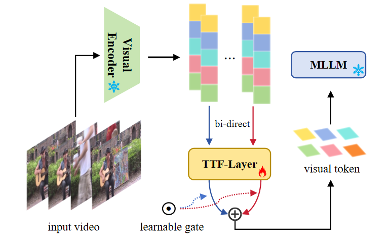
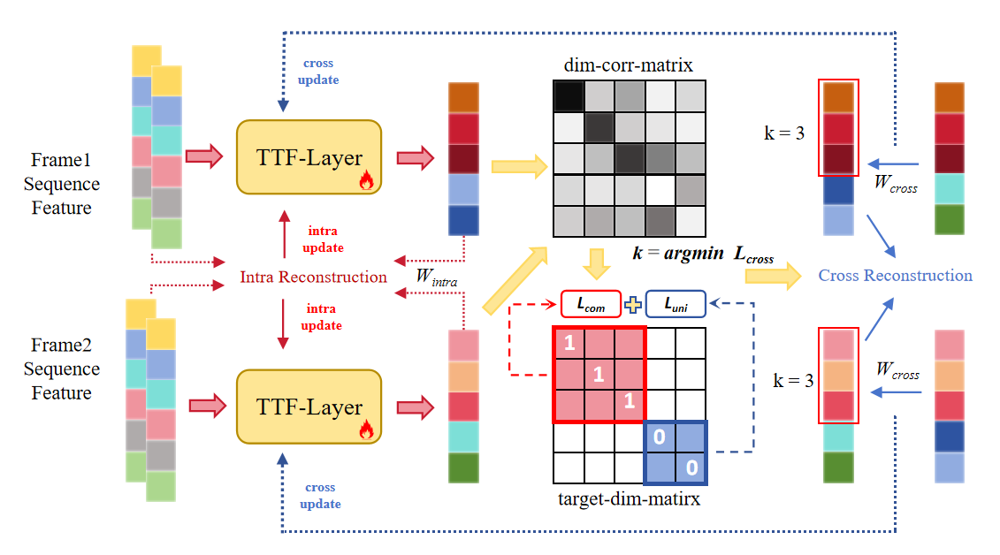

# TTPF: Test Time Perception Fusion

## Overview

TTPF is an innovative approach to enhance multimodal large language models' visual understanding capabilities through a novel fusion mechanism applied at test time.

## Key Features

### TTPF Overall Structure

### Innovative Sequence Perception TTF-Layer

- **Dual-Path Mechanism**:
  - Internal Updates: Single-frame sequence modeling
  - External Updates: Cross-frame global fusion

- **Enhanced Generalization**: Significantly improves model performance in dynamic scenarios

### TTF Update Rule

### Visual Modality Understanding

- Focuses on both commonality and specificity in visual representations
- Enables multimodal large language models to better comprehend and reason about visual information

## Technical Contributions

- Test-time adaptation strategy that doesn't require model retraining
- Sequence-aware perception that captures temporal dependencies
- Modality-specific representation enhancement for better cross-modal alignment

## Applications

- Video understanding and reasoning
- Dynamic visual scene interpretation
- Enhanced visual question answering
